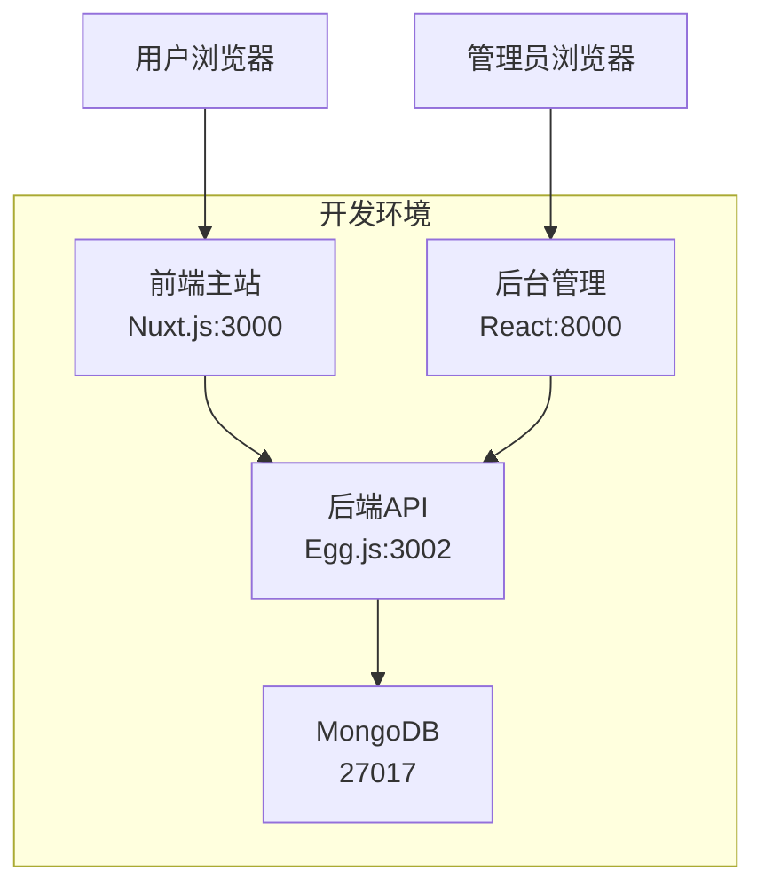
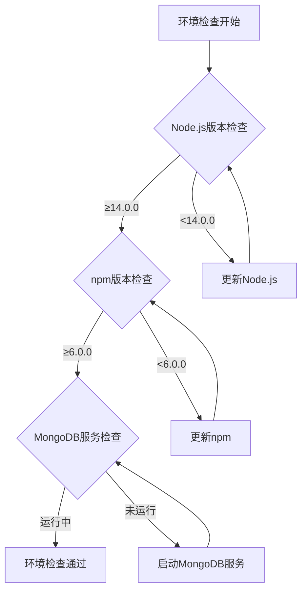
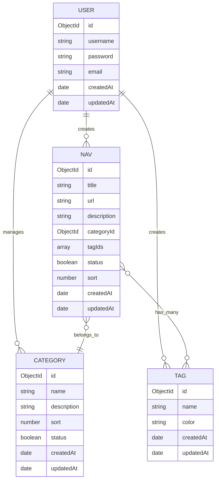
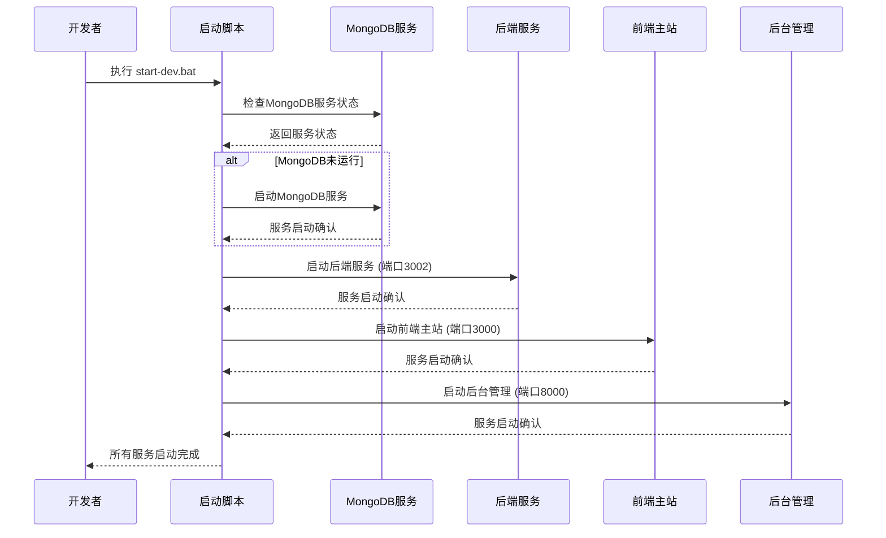
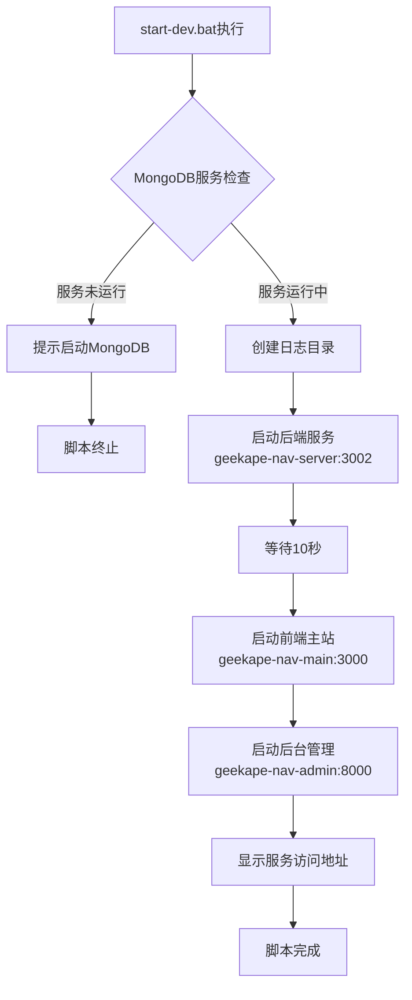
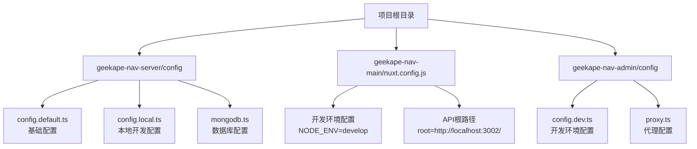

# 极客猿导航系统本地启动设计方案

## 概述

极客猿导航系统是一个基于前后端分离架构的导航站点，包含前端主站、后台管理和后端API三个子系统。本设计文档详细描述项目的本地开发环境启动方案，确保开发者能够快速搭建和运行完整的开发环境。

## 项目架构

### 整体架构图



### 子系统说明

| 子系统 | 技术栈 | 端口 | 功能描述 |
|--------|--------|------|----------|
| geekape-nav-main | Nuxt.js + Vue2 + Element UI + Vuex | 3000 | SSR前端主站，面向终端用户的导航展示 |
| geekape-nav-admin | React + Ant Design Pro + TypeScript | 8000 | 后台管理系统，用于管理导航数据 |
| geekape-nav-server | Egg.js + MongoDB + Mongoose + TypeScript | 3002 | RESTful API服务，提供数据接口 |

## 依赖环境要求

### 系统要求
- **操作系统**: Windows 10/11
- **Node.js**: >= 14.0.0 (推荐 16.x)
- **npm**: >= 6.0.0
- **MongoDB**: >= 4.4 (推荐 6.0+)

### 环境检查



## 数据库设计

### MongoDB配置

| 配置项 | 值 | 说明 |
|--------|-----|------|
| 数据库名 | navigation | 主数据库 |
| 端口 | 27017 | 默认端口 |
| 认证 | 无 | 开发环境暂无认证 |

### 数据模型关系



## 启动流程设计

### 启动时序图



### 启动脚本架构



## 环境配置管理

### 配置文件结构



### 环境变量配置

| 服务 | 变量名 | 值 | 说明 |
|------|--------|-----|------|
| 后端服务 | PORT | 3002 | API服务端口 |
| 后端服务 | MONGODB_URL | mongodb://localhost:27017/navigation | 数据库连接串 |
| 前端主站 | NODE_ENV | develop | 开发环境标识 |
| 前端主站 | root | http://localhost:3002/ | API根路径 |
| 后台管理 | UMI_ENV | dev | UMI开发环境 |
| 后台管理 | REACT_APP_ENV | dev | React应用环境 |

## 服务端架构

### Egg.js后端服务架构

```mermaid
graph TB
    A[HTTP请求] --> B[路由层<br/>app/router.ts]
    B --> C[中间件层]
    C --> D[控制器层<br/>app/controller/]
    D --> E[服务层<br/>app/service/]
    E --> F[模型层<br/>app/model/]
    F --> G[MongoDB数据库]
    
    subgraph "中间件"


