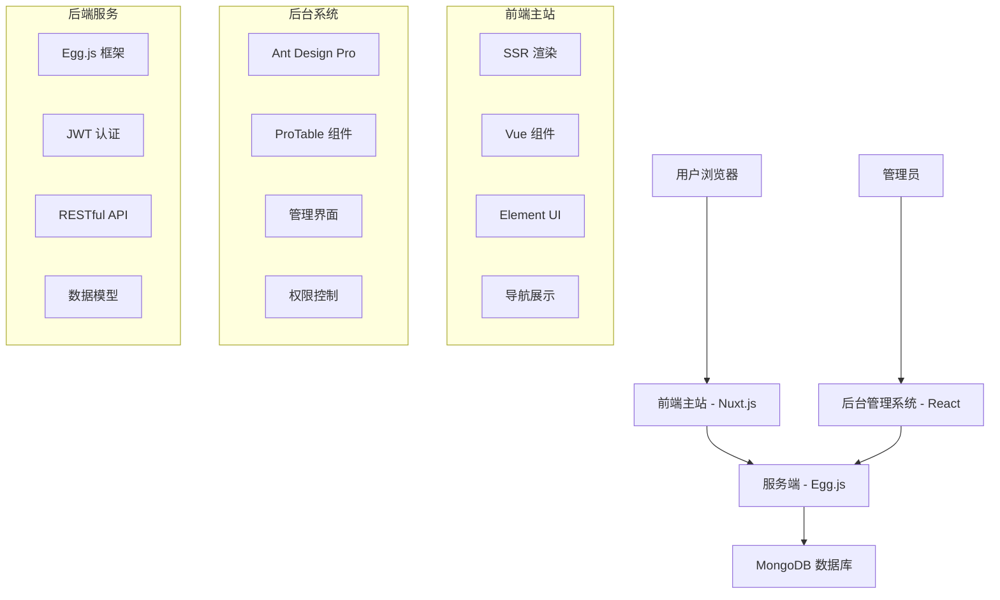
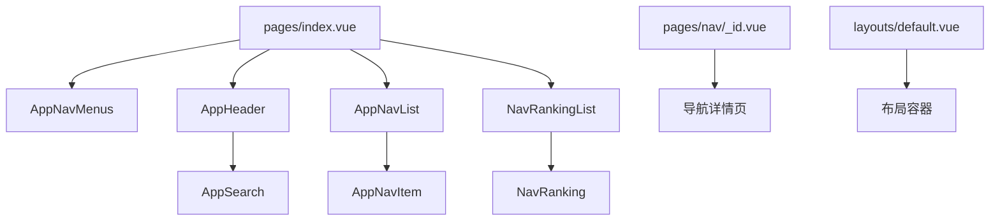
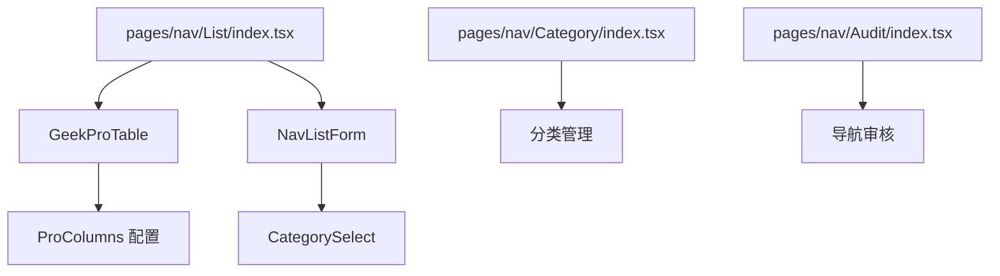
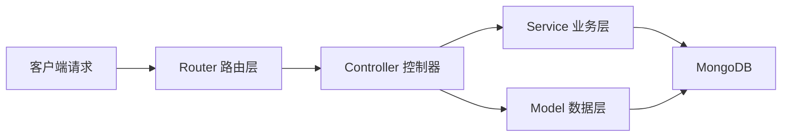
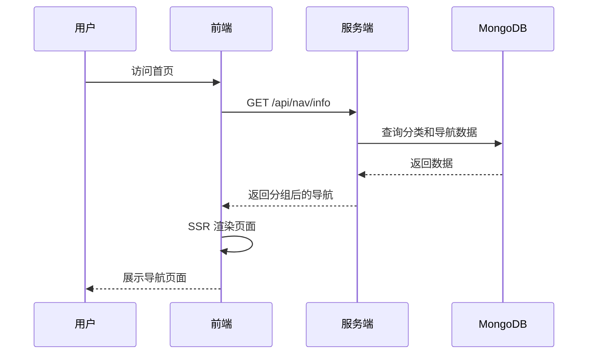

# 极客猿导航源代码分析

## 1. 项目概述

极客猿导航是一个面向独立开发者的全栈导航平台，采用前后端分离架构，包含三个核心子项目：

- **前端主站**（geekape-nav-main）：基于 Nuxt.js 的 SSR 应用，提供用户导航浏览体验
- **后台管理系统**（geekape-nav-admin）：基于 Ant Design Pro 的管理控制台，用于导航内容管理
- **服务端**（geekape-nav-server）：基于 Egg.js 的 Node.js 后端服务，提供 API 接口和数据管理

## 2. 技术架构

### 2.1 整体架构图



### 2.2 技术栈对比

| 模块 | 前端主站 | 后台管理系统 | 服务端 |
|------|----------|-------------|--------|
| **框架** | Nuxt.js (Vue 2) | Ant Design Pro (React) | Egg.js (Node.js) |
| **语言** | JavaScript | TypeScript | TypeScript |
| **UI 库** | Element UI | Ant Design | - |
| **状态管理** | Vuex | useModel/Redux | - |
| **数据库** | - | - | MongoDB + Mongoose |
| **渲染模式** | SSR | SPA | - |
| **认证** | - | JWT | JWT |

## 3. 前端主站架构分析

### 3.1 核心组件结构



**核心页面组件：**

- `pages/index.vue` - 主页，展示分类导航和热门导航
- `pages/nav/_id.vue` - 导航详情页，显示单个网站信息
- `pages/recommend.vue` - 推荐页面，用户提交导航建议

**通用组件：**

- `AppNavMenus` - 侧边栏导航菜单
- `AppHeader` - 顶部搜索栏
- `AppNavItem` - 单个导航卡片
- `AppSearch` - 智能搜索组件（支持站内搜索和外部搜索引擎）

### 3.2 状态管理

使用 Vuex 管理全局状态，主要存储：
- 导航分类数据
- 用户交互状态
- 布局配置

### 3.3 路由配置

采用 Nuxt.js 文件系统路由：
- `/` - 首页
- `/nav/:id` - 导航详情页
- `/recommend` - 推荐页面

## 4. 后台管理系统架构分析

### 4.1 组件层次结构



**核心功能模块：**

- **导航管理** (`pages/nav/List`) - 导航增删改查
- **分类管理** (`pages/nav/Category`) - 导航分类组织
- **审核系统** (`pages/nav/Audit`) - 用户提交内容审核

### 4.2 自定义组件

- `GeekProTable` - 基于 ProTable 的数据表格封装
- `GeekProForm` - 表单处理的 Hook 封装
- `CategorySelect` - 分类选择器组件

### 4.3 数据请求架构

使用统一的 `request.ts` 工具进行 API 请求，支持：
- 请求拦截和响应处理
- 错误统一处理
- 成功消息提示

## 5. 服务端架构分析

### 5.1 MVC 架构模式



### 5.2 核心文件结构

**控制器层** (`app/controller/`)：
- `nav.ts` - 导航相关 API
- `category.ts` - 分类管理 API
- `tag.ts` - 标签管理 API
- `user.ts` - 用户认证 API

**数据模型** (`app/model/`)：
- `nav.ts` - 导航数据模型
- `category.ts` - 分类数据模型
- `tag.ts` - 标签数据模型
- `user.ts` - 用户数据模型

**中间件** (`app/middleware/`)：
- `auth.ts` - JWT 认证中间件
- `error.ts` - 错误处理中间件

### 5.3 数据模型设计

#### 导航模型 (Nav)
```typescript
interface NavModel {
  categoryId: string;     // 分类ID
  name: string;          // 网站名称
  href: string;          // 网站链接
  desc: string;          // 描述
  logo: string;          // Logo URL
  authorName: string;    // 推荐人姓名
  authorUrl: string;     // 推荐人网站
  tags: string[];        // 标签数组
  view: number;          // 浏览量
  star: number;          // 点赞数
  status: number;        // 状态（0:通过, 1:待审核, 2:拒绝）
  createTime: Date;      // 创建时间
  auditTime: Date;       // 审核时间
}
```

### 5.4 API 接口设计

| 接口路径 | 方法 | 功能 | 权限 |
|---------|------|------|------|
| `/api/nav/list` | GET | 获取导航列表 | 需认证 |
| `/api/nav` | POST | 创建导航 | 公开 |
| `/api/nav` | PUT | 更新导航 | 需认证 |
| `/api/nav` | DELETE | 删除导航 | 需认证 |
| `/api/nav/audit` | POST | 审核导航 | 需认证 |
| `/api/nav/reptile` | GET | 网站信息爬取 | 公开 |
| `/api/nav/ranking` | GET | 热门导航排行 | 公开 |

## 6. 核心功能实现分析

### 6.1 导航展示流程



### 6.2 搜索功能实现

前端搜索组件 `AppSearch.vue` 支持两种搜索模式：

1. **站内搜索** - 通过 API 检索导航数据
2. **外部搜索** - 跳转到百度、谷歌等搜索引擎

```typescript
// 搜索引擎配置
const searchGather = {
  baidu: {
    name: '百度',
    placeholder: '百度搜索',
    root: 'https://www.baidu.com/s?wd='
  },
  google: {
    name: '谷歌', 
    root: 'https://www.google.com.hk/search?q='
  }
  // ... 更多搜索引擎
}
```

### 6.3 网站信息爬取

服务端实现自动获取网站信息的爬虫功能：

```typescript
// 使用 request + cheerio 爬取网站信息
async reptile() {
  const { url } = ctx.query
  request(url, (error, requestData, body) => {
    const $ = cheerio.load(body)
    const name = $('title').text()
    const desc = $('meta[name="description"]').attr('content')
    
    resolve({ name, desc, href: url })
  })
}
```

### 6.4 权限控制机制

使用 JWT 实现用户认证：

1. **登录流程** - 验证用户名密码，返回 JWT token
2. **请求认证** - auth 中间件验证 token 有效性
3. **路由保护** - 配置需要认证的路由列表

```typescript
// 需要认证的路由配置
config.routerAuth = [
  "/api/nav",
  "/api/nav/list", 
  // ... 其他受保护路由
];
```

## 7. 性能优化策略

### 7.1 前端优化

- **SSR 渲染** - 提升首屏加载速度和 SEO
- **组件缓存** - 使用 `@nuxtjs/component-cache` 缓存组件
- **代码分割** - Nuxt.js 自动进行路由级代码分割
- **图片懒加载** - Element UI 的 Image 组件支持懒加载

### 7.2 后端优化

- **数据库索引** - 对常查询字段建立索引
- **分页查询** - 限制单次查询数据量
- **缓存策略** - 可增加 Redis 缓存热门数据

## 8. 测试策略

### 8.1 测试文件结构

```
test/
├── app/
│   ├── controller/
│   │   └── home.test.ts
│   └── service/
│       └── Test.test.ts
```

### 8.2 测试工具配置

- **测试框架** - 使用 Egg.js 内置测试工具
- **测试环境** - Jest 配置
- **API 测试** - 针对控制器进行单元测试