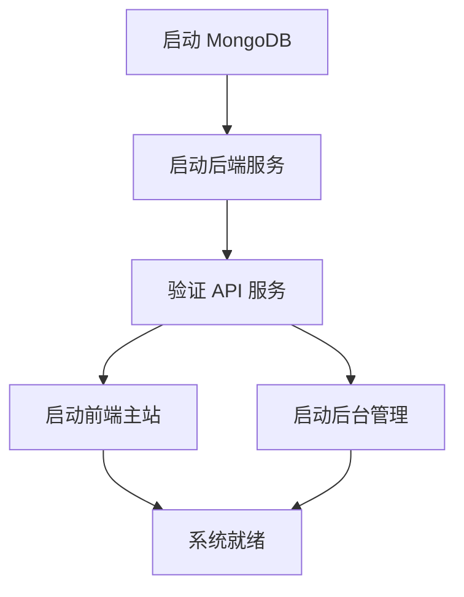

# 极客猿导航系统初始化运行设计

## 1. 概述

极客猿导航是一个面向独立开发者的资源导航站，采用前后端分离的三层架构设计。本文档描述了系统的完整初始化运行流程，包括环境准备、依赖安装、服务启动和验证步骤。

### 系统组成

| 子系统 | 技术栈 | 端口 | 功能 |
|--------|--------|------|------|
| geekape-nav-main | Nuxt.js + Vue2 + Element UI | 3000 | 前端主站（SSR） |
| geekape-nav-admin | React + Ant Design Pro | 8000 | 后台管理系统 |
| geekape-nav-server | Egg.js + MongoDB | 3002 | 后端API服务 |

## 2. 环境要求

### 系统要求
- **操作系统**: Windows 10+ / macOS 10.14+ / Ubuntu 18.04+
- **内存**: 最小 4GB，推荐 8GB+
- **磁盘空间**: 最小 2GB 可用空间

### 运行时环境
- **Node.js**: >= 12.0.0 (推荐 v14.x 或 v16.x)
- **npm**: >= 6.0.0 或 **yarn**: >= 1.22.0
- **MongoDB**: >= 4.0

### 开发工具（可选）
- **IDE**: VSCode / WebStorm
- **版本控制**: Git
- **API调试**: Postman

## 3. 环境准备

### 3.1 Node.js 安装验证

```bash
# 检查 Node.js 版本
node --version

# 检查 npm 版本
npm --version

# 检查 yarn 版本（可选）
yarn --version
```

### 3.2 MongoDB 安装配置

#### Windows 环境
1. 下载 MongoDB Community Server
2. 安装并启动 MongoDB 服务
3. 验证连接：
```bash
mongo --version
```

#### macOS 环境
```bash
# 使用 Homebrew 安装
brew tap mongodb/brew
brew install mongodb-community

# 启动服务
brew services start mongodb-community
```

#### Ubuntu 环境
```bash
# 导入公钥
wget -qO - https://www.mongodb.org/static/pgp/server-4.4.asc | sudo apt-key add -

# 添加源
echo "deb [ arch=amd64,arm64 ] https://repo.mongodb.org/apt/ubuntu focal/mongodb-org/4.4 multiverse" | sudo tee /etc/apt/sources.list.d/mongodb-org-4.4.list

# 安装
sudo apt-get update
sudo apt-get install -y mongodb-org

# 启动服务
sudo systemctl start mongod
sudo systemctl enable mongod
```

### 3.3 项目克隆

```bash
# 克隆项目
git clone [项目地址]
cd geek

# 检查项目结构
ls -la
```

## 4. 依赖安装

### 4.1 全局依赖安装

```bash
# 安装全局依赖（可选但推荐）
npm install -g cross-env
npm install -g nodemon
npm install -g egg-bin
```

### 4.2 子项目依赖安装

使用并行安装提高效率：

```bash
# 进入项目根目录
cd geek

# 并行安装所有子项目依赖
(cd geekape-nav-server && npm install) &
(cd geekape-nav-main && npm install) &
(cd geekape-nav-admin && npm install) &
wait

echo "所有依赖安装完成"
```

### 4.3 依赖安装验证

```bash
# 检查各项目 node_modules
ls geekape-nav-server/node_modules/ | wc -l
ls geekape-nav-main/node_modules/ | wc -l
ls geekape-nav-admin/node_modules/ | wc -l
```

## 5. 配置设置

### 5.1 数据库配置

#### MongoDB 连接配置
文件位置：`geekape-nav-server/config/config.default.ts`

```typescript
// MongoDB 连接配置示例
export default {
  mongoose: {
    client: {
      url: 'mongodb://localhost:27017/geek_nav',
      options: {
        useUnifiedTopology: true,
        useNewUrlParser: true,
      },
    },
  },
};
```

### 5.2 API 接口配置

#### 前端主站配置
文件位置：`geekape-nav-main/nuxt.config.js`

```javascript
// API 基础地址配置
export default {
  axios: {
    baseURL: process.env.NODE_ENV === 'production' 
      ? 'https://api.geekape.net' 
      : 'http://localhost:3002'
  }
}
```

#### 后台管理配置
文件位置：`geekape-nav-admin/src/services/api.ts`

```typescript
// 后台 API 配置
const API_BASE_URL = process.env.NODE_ENV === 'development'
  ? 'http://localhost:3002'
  : 'https://api.geekape.net';
```

### 5.3 环境变量配置

创建环境配置文件：

```bash
# 后端服务环境变量
echo "NODE_ENV=development
PORT=3002
MONGODB_URL=mongodb://localhost:27017/geek_nav
JWT_SECRET=your_jwt_secret_key" > geekape-nav-server/.env

# 前端主站环境变量  
echo "NODE_ENV=development
API_BASE_URL=http://localhost:3002" > geekape-nav-main/.env

# 后台管理环境变量
echo "REACT_APP_ENV=dev
REACT_APP_API_BASE_URL=http://localhost:3002" > geekape-nav-admin/.env
```

## 6. 系统启动流程

### 6.1 启动顺序设计



### 6.2 服务启动命令

#### 第一步：启动数据库
```bash
# 确保 MongoDB 服务运行
# Windows
net start MongoDB

# macOS
brew services start mongodb-community

# Ubuntu
sudo systemctl start mongod
```

#### 第二步：启动后端服务
```bash
cd geekape-nav-server
npm run dev

# 预期输出：
# [egg] server started successfully in 2000ms
# [egg] application server started on http://127.0.0.1:3002
```

#### 第三步：启动前端服务（并行）
```bash
# 启动前端主站
cd geekape-nav-main
npm run dev &

# 启动后台管理
cd geekape-nav-admin  
npm start &

wait
```

### 6.3 一键启动脚本

创建启动脚本 `start-dev.sh`：

```bash
#!/bin/bash

echo "🚀 启动极客猿导航开发环境..."

# 检查 MongoDB 状态
if ! pgrep -x "mongod" > /dev/null; then
    echo "❌ MongoDB 未运行，请先启动 MongoDB"
    exit 1
fi

# 启动后端服务
echo "🔧 启动后端服务..."
cd geekape-nav-server
npm run dev > ../logs/server.log 2>&1 &
SERVER_PID=$!

sleep 5

# 检查后端服务是否启动成功
if ! curl -s http://localhost:3002/health > /dev/null; then
    echo "❌ 后端服务启动失败"
    kill $SERVER_PID
    exit 1
fi

echo "✅ 后端服务启动成功 (PID: $SERVER_PID)"

# 启动前端服务
echo "🎨 启动前端主站..."
cd ../geekape-nav-main
npm run dev > ../logs/main.log 2>&1 &
MAIN_PID=$!

echo "⚡ 启动后台管理..."
cd ../geekape-nav-admin
npm start > ../logs/admin.log 2>&1 &
ADMIN_PID=$!

echo "📝 进程ID记录:"
echo "  后端服务: $SERVER_PID"
echo "  前端主站: $MAIN_PID"  
echo "  后台管理: $ADMIN_PID"

echo "🎉 所有服务启动完成！"
echo "📱 前端主站: http://localhost:3000"
echo "🔧 后台管理: http://localhost:8000"
echo "🔗 API服务: http://localhost:3002"
```

## 7. 服务验证

### 7.1 健康检查

#### 后端 API 服务验证
```bash
# 检查服务状态
curl -X GET http://localhost:3002/health

# 预期响应
{
  "status": "ok",
  "timestamp": "2023-xx-xx",
  "services": {
    "mongodb": "connected",
    "server": "running"
  }
}
```

#### 前端服务验证
```bash
# 检查前端主站
curl -I http://localhost:3000

# 检查后台管理
curl -I http://localhost:8000

# 预期状态码：200
```

### 7.2 功能验证清单

| 验证项 | 验证方法 | 预期结果 |
|--------|----------|----------|
| 数据库连接 | 查看服务日志 | 无连接错误 |
| API 接口 | 访问 `/api/nav` | 返回导航数据 |
| 前端渲染 | 浏览器访问主站 | 页面正常显示 |
| 后台登录 | 访问管理界面 | 登录页面正常 |
| 跨域配置 | 前端调用 API | 无 CORS 错误 |

### 7.3 常见问题诊断

#### 端口冲突问题
```bash
# 检查端口占用
netstat -an | grep :3000
netstat -an | grep :3002
netstat -an | grep :8000

# 杀死占用进程
lsof -ti:3000 | xargs kill -9
```

#### MongoDB 连接问题
```bash
# 测试 MongoDB 连接
mongo --eval "db.adminCommand('ismaster')"

# 检查数据库状态
mongo --eval "db.stats()"
```

#### Node.js 版本兼容性
```bash
# 检查 Node.js 版本兼容性
node -e "console.log(process.version)"

# 使用 nvm 切换版本（如需要）
nvm use 14
```

## 8. 开发环境配置

### 8.1 IDE 配置推荐

#### VSCode 扩展
- **Vue 开发**: Vetur, Vue 3 Snippets
- **React 开发**: ES7+ React/Redux/React-Native snippets
- **TypeScript**: TypeScript Importer
- **代码格式化**: Prettier, ESLint
- **Git 工具**: GitLens

#### 工作区配置
```json
{
  "folders": [
    {"path": "./geekape-nav-main"},
    {"path": "./geekape-nav-admin"}, 
    {"path": "./geekape-nav-server"}
  ],
  "settings": {
    "editor.formatOnSave": true,
    "editor.codeActionsOnSave": {
      "source.fixAll.eslint": true
    }
  }
}
```

### 8.2 调试配置

#### 后端调试配置
创建 `.vscode/launch.json`：

```json
{
  "version": "0.2.0",
  "configurations": [
    {
      "name": "Debug Egg.js Server",
      "type": "node",
      "request": "launch",
      "cwd": "${workspaceFolder}/geekape-nav-server",
      "runtimeExecutable": "npm",
      "runtimeArgs": ["run", "debug"]
    }
  ]
}
```

#### 前端调试配置
```json
{
  "name": "Debug Nuxt.js",
  "type": "node", 
  "request": "launch",
  "cwd": "${workspaceFolder}/geekape-nav-main",
  "runtimeExecutable": "npm",
  "runtimeArgs": ["run", "dev"],
  "env": {
    "NODE_ENV": "development"
  }
}
```

### 8.3 热重载配置

确保开发环境支持热重载：

#### 后端热重载
在 `geekape-nav-server/package.json` 中：
```json
{
  "scripts": {
    "dev": "egg-bin dev --port=3002 --watch"
  }
}
```

#### 前端热重载
Nuxt.js 和 Umi 默认支持热重载，确保配置正确：

```javascript
// nuxt.config.js
export default {
  watchers: {
    webpack: {
      poll: true
    }
  }
}
```

## 9. 数据初始化

### 9.1 数据库结构初始化

#### 创建基础集合
```javascript
// MongoDB 初始化脚本
use geek_nav;

// 创建用户集合
db.createCollection("users");

// 创建导航集合  
db.createCollection("navs");

// 创建分类集合
db.createCollection("categories");

// 创建标签集合
db.createCollection("tags");
```

#### 插入初始数据
```javascript
// 插入默认管理员账户
db.users.insertOne({
  username: "admin",
  password: "$2a$10$encrypted_password_hash",
  email: "admin@geekape.net", 
  role: "admin",
  createdAt: new Date(),
  updatedAt: new Date()
});

// 插入默认分类
db.categories.insertMany([
  {
    name: "开发工具",
    description: "开发相关工具和资源",
    order: 1,
    status: 1,
    createdAt: new Date()
  },
  {
    name: "设计资源", 
    description: "UI/UX设计资源",
    order: 2,
    status: 1,
    createdAt: new Date()
  }
]);
```

### 9.2 示例数据导入

创建数据导入脚本 `scripts/import-data.js`：

```javascript
const mongoose = require('mongoose');

const sampleData = {
  navs: [
    {
      title: "GitHub",
      url: "https://github.com",
      description: "全球最大的代码托管平台",
      category: "开发工具",
      tags: ["代码", "开源"],
      status: 1
    }
  ]
};

async function importData() {
  try {
    await mongoose.connect('mongodb://localhost:27017/geek_nav');
    
    // 导入导航数据
    for (const nav of sampleData.navs) {
      await db.navs.insertOne(nav);
    }
    
    console.log('✅ 示例数据导入成功');
  } catch (error) {
    console.error('❌ 数据导入失败:', error);
  } finally {
    await mongoose.disconnect();
  }
}

importData();
```

## 10. 测试验证

### 10.1 单元测试运行

#### 后端测试
```bash
cd geekape-nav-server
npm run test

# 预期输出格式
#   ✓ should GET /api/nav (200ms)
#   ✓ should POST /api/nav (150ms)
#   ✓ should PUT /api/nav/:id (120ms)
```

#### 前端测试
```bash
cd geekape-nav-admin
npm run test

# 运行特定测试
npm run test -- --testNamePattern="NavList"
```

### 10.2 集成测试

创建端到端测试脚本 `e2e-test.sh`：

```bash
#!/bin/bash

echo "🧪 运行集成测试..."

# 等待服务启动
sleep 10

# 测试后端 API
echo "🔧 测试后端 API..."
response=$(curl -s -o /dev/null -w "%{http_code}" http://localhost:3002/api/nav)
if [ $response -eq 200 ]; then
    echo "✅ 后端 API 测试通过"
else
    echo "❌ 后端 API 测试失败 (状态码: $response)"
    exit 1
fi

# 测试前端页面
echo "🎨 测试前端页面..."
response=$(curl -s -o /dev/null -w "%{http_code}" http://localhost:3000)
if [ $response -eq 200 ]; then
    echo "✅ 前端页面测试通过"
else
    echo "❌ 前端页面测试失败 (状态码: $response)"
    exit 1
fi

# 测试后台管理
echo "⚡ 测试后台管理..."
response=$(curl -s -o /dev/null -w "%{http_code}" http://localhost:8000)
if [ $response -eq 200 ]; then
    echo "✅ 后台管理测试通过"
else
    echo "❌ 后台管理测试失败 (状态码: $response)"
    exit 1
fi

echo "🎉 所有集成测试通过！"
```

### 10.3 性能基准测试

使用 Apache Bench 进行基础性能测试：

```bash
# 测试 API 性能
ab -n 1000 -c 10 http://localhost:3002/api/nav

# 测试前端页面性能  
ab -n 100 -c 5 http://localhost:3000/

# 预期结果指标：
# - 响应时间 < 200ms
# - 并发处理能力 > 100 req/s
# - 错误率 < 1%
```